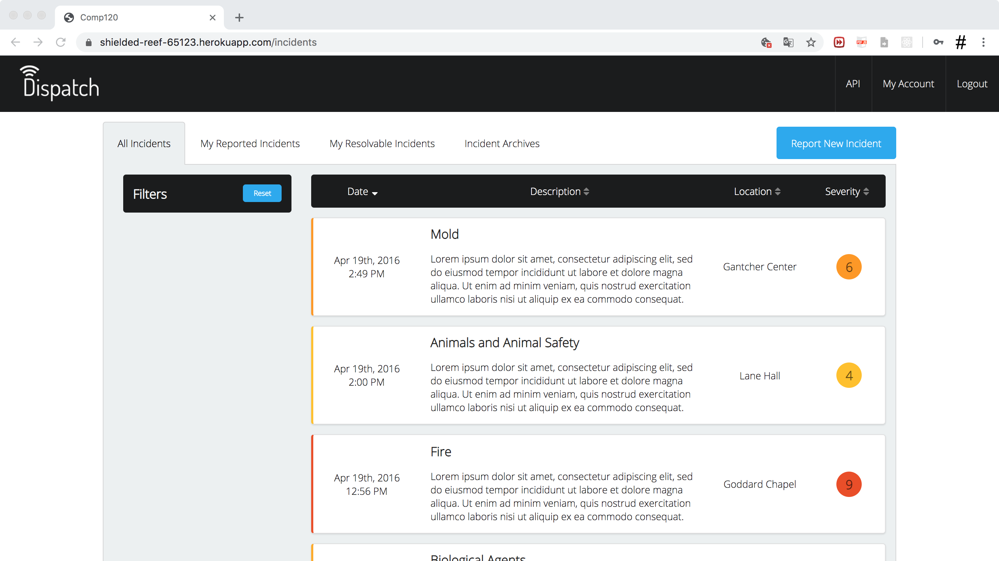
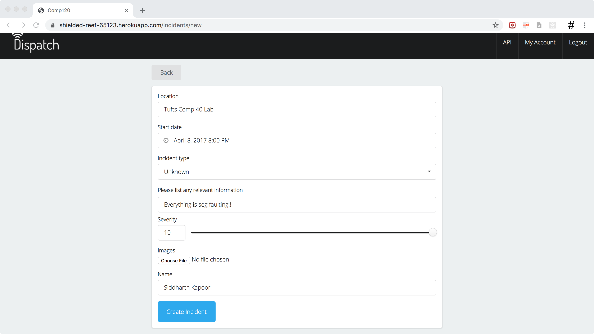
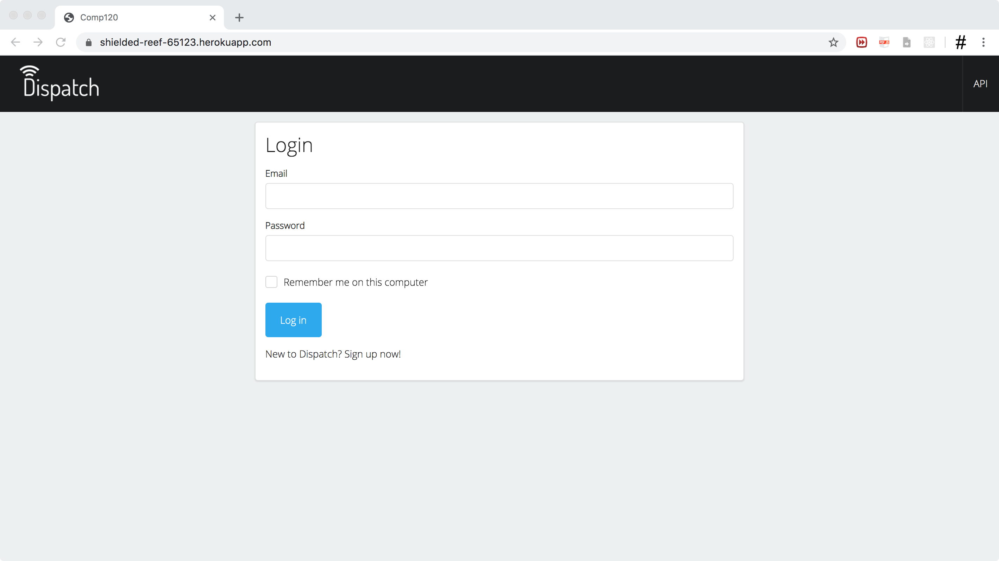
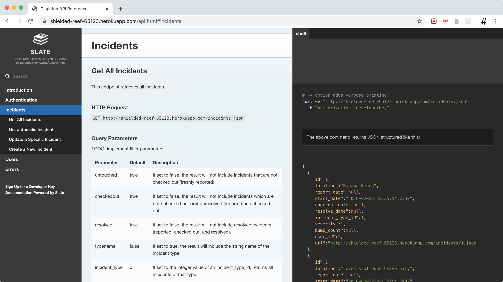

# Dispatch - An Incident's Portal


Dispatch is an incident's portal with an API that allows clients to access
vital information outside the portal itself. This is a collaborative project
made in fulfilment of the Tufts COMP 120 - Web Engineering Final Project
Requirement.

See a live demo [HERE](https://shielded-reef-65123.herokuapp.com/).

Access the API [HERE](https://shielded-reef-65123.herokuapp.com/api.html).

Please request for a username and password from one of the authors to access
the demo.

## Table of Contents
1. [Introduction](#introduction)
2. [Features](#features)
3. [Project Legs](#project-legs)
4. [Installation Guide](#installation-guide)
    1. [Virtual Machine](#virtual-machine)
    2. [Ruby on Rails](#ruby-on-rails)
    3. [Creating the Team Project](#creating-the-team-project)
    4. [PostgreSQL](#postgresql)
    5. [Pulling the Team Project](#pulling-the-team-project)
5. [Style Guide and Workflow Tips](#style-guide-and-workflow-tips)

## Introduction

This is the working repository for the Comp120 Team 4's incident-reporting solution. All the code necessary to run the minimum viable product will be found here.

Authors:
* :tiger: Dariusz Adamczyk
* :horse: Jared Gall 
* :dragon: Siddharth Kapoor
* :elephant: Maya Saxena

## Features

1. Report incidents by categories and urgency

2. Password protected log-ins

3. A RESTful API made via [Slate](https://github.com/slatedocs/slate)

4. Clean design using [Semantic UI](https://semantic-ui.com/)

## Project Legs
* [Leg 1 - Data Schema and Wireframe](/docs/leg-1.md)
* [Leg 2 - Implementing the MVP](/docs/leg-2.md)
* [Leg 3 - Production, Unit Testing, Code Review](/docs/leg-3.md)
* [Leg 4 - Static Content Optimizations](/docs/static_performance.md)
* [Leg 5 - API](/docs/leg-5.md)
* [Leg 6 - Polling and Caching](/docs/polling.md)

## Installation Guide
### Virtual Machine
Follow the instructions at [Comp20 VM](http://www.cs.tufts.edu/comp/20/vm/).

1. Download and install the Hyperviser VMware. Here is the student version provided by Tufts [VMware Fusion](http://vmap-tufts.onthehub.com/).
2. Download and extract the VMware Virtual Machine [TuftsCS-VM](http://www.cs.tufts.edu/comp/20/vm/TuftsCS-vmware.zip).
3. Open the VMware Workstation, select the Home tab, and choose `Open a Virtual Machine`. Navigate to the location of the extracted **TuftsCS-VM**, and select the vmware configuration file `Ubuntu.vmwarevm > Ubuntu`. The VMware Workstation will open the config file and start an instance of Ubuntu in the sandbox, or virtual machine, environment. 

### Ruby on Rails
Follow the instructions at:
* [RailsAppsProject](http://railsapps.github.io/installrubyonrails-ubuntu.html).

RVM and Ruby are already pre-installed on the Tufts VM.
Update your package manager, VM software, and Ruby Gems first (prevent installation of documentation with echo and pipe command):
```shell
$ sudo apt-get update
$ sudo apt-get upgrade
$ sudo apt-get dist-upgrade
$ echo "gem: --no-document" >> ~/.gemrc
$ gem update
```

### Creating the Team Project 
Below is the procedure we took to create our project.

Install PostgreSQL:
```shell
$ sudo apt-get install postgresql
```

Create the project directory.
At the point in time when we cloned, the git project just had a README and design pdf's.
Same as above; navigate to the parent project directory, clone the project, and create a gemset with the same name as the project directory. 
Finally, create a new rails project.
```shell
$ git clone <PROJECT-LINK> comp120
$ rvm use ruby-2.3.0@comp120 --ruby-version --create
$ gem install rails --version=4.2.0
$ rails new . --database=postgresql 
```

### PostgreSQL
1. Start the PostgreSQL server.
2. Open a new tab in the terminal
3. Switch into the postgres user 
4. Run the following commands to create the database and user required by Rails:
```shell
$ sudo service postgresql start
$ sudo su postgres
$ createdb postgres
$ createuser -s comp120
```

Return to the original tab, and create all necessary database namespaces (one for dev, test, and production).
```shell
$ rake db:create:all
```
At this stage, all necessary steps have been performed to setup the Rails and database development environment.

### Pulling the Team Project
Move into the directory where you would like to keep the project. Perform the classic git clone (or git pull origin master if you have already cloned the project). 
**Always perform a Bundle install to update all gems and dependencies of the project!**
```shell
$ git clone <PROJECT-LINK> comp120
$ cd comp120
$ bundle install 
```

Following major updates to the data model, perform the following commands to update the schema, **ONLY IF** you do not have any valuable information within the database (this will clear out the database, and rebuild from scratch).
Since we will be determining what data is in our database, and will always be able to recreate or recover it, clearing the database should pose no problem for now.
```shell
$ rake db:schema:load
$ rake db:seed
```

Otherwise, call the following, substituting `timestamp` with the time of the last migration you want to include.

```shell
$ rake db:migrate VERSION=timestamp
```

## Style Guide and Workflow Tips
* [GitHub Workflow](/git-flow.md)
* [Rake Commands](http://jacopretorius.net/2014/02/all-rails-db-rake-tasks-and-what-they-do.html)

### Style Guide
* Indentation 4 spaces
* No tabs
* Rails naming convention
* Detailed migration names
* Comment code that is non-trivial, such as javascript that will modify the new incident form based on user input
* Database constraint naming
    * Loosely inspired by [this article](http://www.databasedesign-resource.com/constraint-naming-standard.html)
    * TableName_ConstraintType_ColumnName
    * TableName_ConstraintType_ColumnCount (if multiple columns are under the constraint)
    * Constraint Types
        * FK - foreign key
        * UQ - unique
        * CK - check
    * Examples:
        * IncidentTypes_UQ_Name
        * IncidentDetails_UQ_2 (unique incident_id, comment_id)
    

